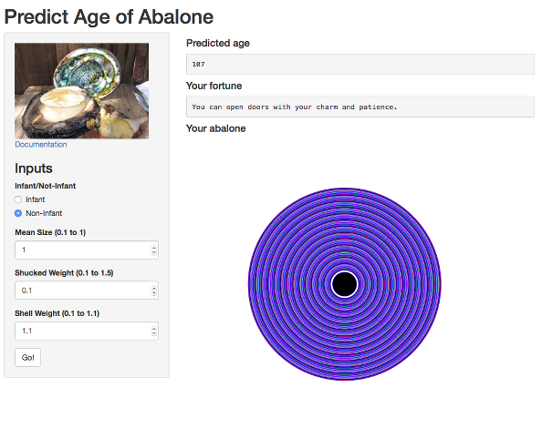

## Background

* To some Chinese people, Abalone is a food you eat at special occasions like wedding banquets mostly because it is expensive.

* Texturally, it's right between a scallop and squid with a crunchiness similar to a conch but closest to the sensation you get eating jellyfish.

---

## You need the AbaloneApp

* If you're going to eat abalone, the most important thing to remember is your wallet.  One of the largest can set you back more than $20.

* You can use the AbaloneApp to predict the age of the abalone you want to eat and get the most value from your hard earned dollars!
```{r echo = FALSE}
library(MASS)
library(rms)
abnames = c('sex','length','diameter','height','weight.w','weight.s','weight.v','weight.sh','rings')
abalone = read.csv("data/abalone.data", header = F , sep = ',', col.names = abnames)
abalone$height[abalone$height==0] = NA
abalone$sex = as.character(abalone$sex)
abalone$sex[abalone$sex != 'I'] = 'K'
abalone$sex = as.factor(abalone$sex)

abalone$weight.diff = abalone$weight.w - 
    (abalone$weight.v + abalone$weight.s + abalone$weight.sh)
abalone$height[2052] = 0.130
abalone$weight.mean1 = (abalone$weight.s*abalone$weight.v*abalone$weight.sh)^(1/3)
abalone$weight.mean2 = (abalone$weight.w*abalone$weight.s*abalone$weight.sh*abalone$weight.v)^(1/4)
abalone$weight.norm1 = sqrt(abalone$weight.s^2 + abalone$weight.v^2 + abalone$weight.sh^2)
abalone$weight.norm2 = sqrt(abalone$weight.w^2 + abalone$weight.s^2 + abalone$weight.v^2 + abalone$weight.sh^2)
abalone$size.norm = sqrt(abalone$length^2 + abalone$diameter^2 + abalone$height^2) # Norm of vectors
abalone$size.mean = (abalone$length*abalone$diameter*abalone$height)^(1/3)         # Geometric Mean

```

* Sample prediciton
```{r}
# best fit multiple regression model
abfit7.2 = lm(log(rings) ~ sex + log(size.mean) + weight.s + weight.sh, data = abalone)

p <- predict(abfit7.2, newdata = data.frame(sex = "K", size.mean = 0.38,
                                            weight.s = 0.45, weight.sh = 0.35))
round(exp(p),0)

```

---

## How to use the AbaloneApp

Simply specify if it's an infant or non-infant, mean abalone size, shucked weight, and shell weight and click Go!


---

## Results
Your abalone's predicted age will appear with a fortune and a picture!

So go to https://calvinsbiz.shinyapps.io/AbaloneApp now!



