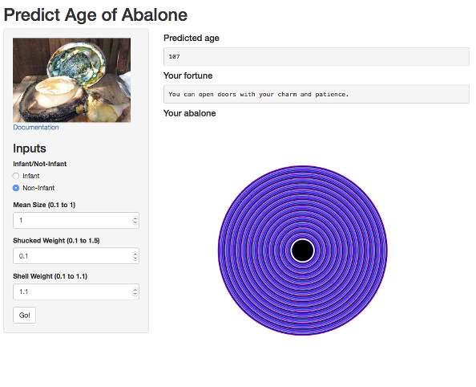

## Background

* To some Chinese people, Abalone is a food you eat at special occasions like wedding banquets mostly because it is expensive.

* Texturally, it's right between a scallop and squid with a crunchiness similar to a conch but closest to the sensation you get eating jellyfish.

---

## You need the AbaloneApp

* If you're going to eat abalone, the most important thing to remember is your wallet.  One of the largest can set you back more than $20.

* You can use the AbaloneApp to predict the age of the abalone you want to eat and get the most value from your hard earned dollars!


* Sample prediciton

```r
# best fit multiple regression model
abfit7.2 = lm(log(rings) ~ sex + log(size.mean) + weight.s + weight.sh, data = abalone)

p <- predict(abfit7.2, newdata = data.frame(sex = "K", size.mean = 0.38,
                                            weight.s = 0.45, weight.sh = 0.35))
round(exp(p),0)
```

```
##  1 
## 12
```

---

## How to use the AbaloneApp

Simply specify if it's an infant or non-infant, mean abalone size, shucked weight, and shell weight and click Go!


---

## Results
Your abalone's predicted age will appear with a fortune and a picture!

So go to https://calvinsbiz.shinyapps.io/AbaloneApp now!



